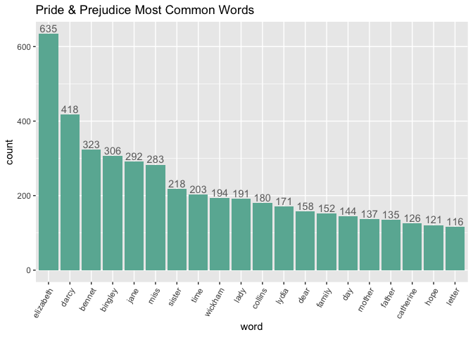

STAT 545B Assignment B-4
================
Sarah Masri
2023-12-06

# Option A - Strings and Functional Programming in R

## Load Packages

``` r
library(tidyverse)
library(janeaustenr)
library(tidytext)
library(testthat)
```

## Exercise 1

We first choose the book Pride & Prejudice, contained in the
`janeaustenr` package, along with the following books:

1.  Sense & Sensibility
2.  Pride & Prejudice  
3.  Mansfield Park  
4.  Emma  
5.  Northanger Abbey  
6.  Persuasion

``` r
## Select book field from janeaustenr::austen_books() to find all unique books available in the janeaustenr package
books <- austen_books() %>% select(book) %>% unique()
print(books)
```

    ## # A tibble: 6 × 1
    ##   book               
    ##   <fct>              
    ## 1 Sense & Sensibility
    ## 2 Pride & Prejudice  
    ## 3 Mansfield Park     
    ## 4 Emma               
    ## 5 Northanger Abbey   
    ## 6 Persuasion

We aim to make a plot of the most common words in Pride & Prejudice.
First, we must create a tibble of all the words in the book. This list
has the following properties:

- all letters are lowercase (e.g., “Pride” and “pride” should not be
  considered distinct in our frequency plot)
- only alphabetic characters are included (non-letters such as
  punctuation are removed)
- words may repeat (this allows us to count frequency of each distinct
  word in the book)
- each item in the list represents exactly one word (not an empty
  string, and not a sentence or group of words)

Note that words with different tenses, punctuation, or plurality will be
regarded as distinct words. For example, “daughter’s” is distinct from
“daughter” and “observing” is considered distinct from “observe”.

``` r
## Create a tibble of words in Pride and Prejudice. 
pp_words <- prideprejudice %>% 
            str_to_lower() %>%                    ## make all letters lowercase
            str_split("[\\W\\s]+") %>%            ## split words by one or more non-word characters or any whitespace
            unlist() %>%                          ## unlist to get single list of words
            str_remove_all("[^a-zA-Z]") %>%       ## remove all all non-letters from words (punctuation, numbers, etc.)
            str_subset(".+") %>%                  ## remove all empty strings from list
            as_tibble() %>%                       ## convert list to tibble
            setNames("word")                      ## name 'word' column

head(pp_words)
```

    ## # A tibble: 6 × 1
    ##   word     
    ##   <chr>    
    ## 1 pride    
    ## 2 and      
    ## 3 prejudice
    ## 4 by       
    ## 5 jane     
    ## 6 austen

Now that we have a list of *all* words in Pride & Prejudice, we may
remove any “stop words” using `tidetext::stop_words` and summarise the
number of times each word appears in the the book.

``` r
## Create list of stop words
to_remove <- stop_words %>% 
             select(word) %>%               ## select words column from stop_words
             .[[1]] %>%                     ## get list of words
             str_remove_all("[^a-zA-Z]")    ## remove all all non-letters from words to match words in pp_words 

## Create a tibble of words in Pride and Prejudice, excluding stop words. 
pp_words_count <- pp_words %>% 
                  filter(!word %in% to_remove)  %>% ## filter out stop words
                  group_by(word) %>%                ## group data by word
                  summarise(count = n()) %>%        ## find frequency of each word
                  arrange(desc(count))              ## arrange words from most frequent to least frequent

head(pp_words_count)
```

    ## # A tibble: 6 × 2
    ##   word      count
    ##   <chr>     <int>
    ## 1 elizabeth   635
    ## 2 darcy       418
    ## 3 bennet      323
    ## 4 bingley     306
    ## 5 jane        292
    ## 6 miss        283

Finally, we plot the frequency in decreasing order, taking only the 20
most common words.

``` r
n <- 20

## Plot n most common words
## Extra resource to title x-axis label: ## from https://stackoverflow.com/questions/1330989/rotating-and-spacing-axis-labels-in-ggplot2
## Colour code from: https://r-graph-gallery.com/ggplot2-color.html
## To write count ontop of each bin: https://stackoverflow.com/questions/12018499/how-to-put-labels-over-geom-bar-for-each-bar-in-r-with-ggplot2
pp_words_count %>% slice(1:n) %>% ggplot(aes(x = reorder(word, desc(count)), y = count)) + 
                                  geom_col(fill = '#69b3a2') + 
                                  guides(x =  guide_axis(angle = 60)) + 
                                  geom_text(aes(label=count), position=position_dodge(width=0.8), vjust=-0.25, col = 'gray43') + 
                                  ggtitle("Pride & Prejudice Most Common Words") + 
                                  xlab("word")
```

<!-- -->

## Exercise 2

In this exercise, we make a function that converts words into our own
version of Pig Latin. Call this new made-up language Cow Latin. Cow
Latin consists of two components:

<ins>
Rearrangement component:
</ins>

1.  For words that end in a consonant, take the group of characters from
    the last vowel of the word to the last consonant, and move it to the
    front (for example, c<ins>ows</ins> becomes <ins>ows</ins>c). If the
    word has no vowel (including “y”), then leave the word as it is
    until the addition component below.  
2.  For words that end in vowels, move only the last vowel to the front.

<ins>
Addition component:
</ins>

1.  If the rearranged word ends with a vowel, add “moo” to the end of
    the word and “m” at the beginning of the word.
2.  If the rearranged word begins with a vowel *and* ends in a
    consonant, then add “oo” to the end of the word and “m” at the
    beginning of the word.
3.  If the rearranged word begins with a consonant, add “moo” to the
    beginning of the word and “oo” to the end of the word. Note that due
    to the rearrangement pattern above, this is only applicable to for
    rare “words” with no vowels (e.g., mrs).

*Note: For the purposes of this made-up language, ‘y’ is always
considered a vowel.*

### Implementation

``` r
#' @title Cow Latin Translator
#' 
#' @description This function converts a word or list of words into Cow Latin.
#' Translation works in two components:
#' 
#' 1. Rearrangement
#'    i.   For words that end in a consonant, take the group of characters from 
#'         the last vowel of the word to the last consonant, and move it to the front.  
#'         If the word has no vowel (including "y"), then leave the word as it is 
#'         until the addition component below.  
#'    ii.  For words that end in vowels, move only the last vowel to the front.
#'    
#' 2. Addition
#'    i.   If the rearranged word ends with a vowel, add "moo" to the end of the 
#'         word and "m" at the beginning of the word. 
#'    ii.  If the rearranged word begins with a vowel AND ends in a consonant, 
#'         then add "oo" to the end of the word and "m" at the beginning of the word. 
#'    iii. If the rearranged word begins with a consonant, add "moo" to the 
#'         beginning of the word and "oo" to the end of the word.
#' 
#' @param words_list A string or list of strings. Each string must only contain 
#' letter characters with no white space, numbers, or punctuation.  
#' 
#' @return A list of strings with each element being the translated Cow Latin 
#' word corresponding to the words_list parameter. All characters are returned 
#' in lower case.
#' 
#' @import tidyverse
#' @export
Cow_Latin <- function(words_list) {
  ## Check that each word in words_list is made up of only letters.
  if(!all(str_detect(words_list, "^[:alpha:]+$"))) {
    stop("Please ensure all words are made up of only letters (remove any white space, numbers, punctuation, etc.)")
    }
  
  ## Initialize result with NA values.
  n <- length(words_list)
  cow_words <- rep(NA, n)
  
  ## Detect indices in words_list that end with consonants and vowels separately.
  ends_cons <- str_detect(words_list, "\\w*[^AEIOUYaeiouy]$")
  ends_vow <- str_detect(words_list, "\\w*[AEIOUYaeiouy]$")
  
  ## Rearrangement 1: For words that end in consonants, move chunk of word from last vowel to last consonant to the beginning. 
  cow_words[ends_cons] <- str_c(str_sub(words_list[ends_cons], str_locate(words_list[ends_cons], "[AEIOUYaeiouy](?=[^AEIOUYaeiouy]*$)")[,1], -1),
                                str_sub(words_list[ends_cons], 1, str_locate(words_list[ends_cons], "[AEIOUYaeiouy](?=[^AEIOUYaeiouy]*$)")[,1]-1))
  
  ## Rearrangement 2: For words that end in vowels, move last vowel to the beginning. 
  cow_words[ends_vow] <- str_c(str_sub(words_list[ends_vow], -1, -1), str_sub(words_list[ends_vow] , 1, -2))
    
  ## Replace missing values corresponding to rare "words" with no vowels. 
  cow_words[is.na(cow_words)] <- words_list[is.na(cow_words)]
  
  ## Detect rearranged words that end with consonants and vowels, or have no vowels separately.
  rearr_ends_vow <- str_detect(cow_words, "\\w*[AEIOUYaeiouy]$")
  rearr_begins_vow_ends_cons <- str_detect(cow_words, "^[AEIOUYaeiouy].*[^AEIOUYaeiouy]$")
  no_vows <- str_detect(cow_words, "^[^AEIOUYaeiouy]*$")
  
  
  ## Addition 1: For words that end in a vowel, add "m" to the beginning and "moo" to the end of the word.
  cow_words[rearr_ends_vow] <- str_c("m", cow_words[rearr_ends_vow], "moo")
  
  ## Addition 2: For words that start with a vowel end in a consonant, add "m" to the beginning and "oo" to the end of the word.
  cow_words[rearr_begins_vow_ends_cons] <- str_c("m", cow_words[rearr_begins_vow_ends_cons], "oo")
  
  ## Addition 3: For rare words that have no vowels, add "moo" to the beginning of the word. 
  cow_words[no_vows] <- str_c("moo", cow_words[no_vows], "oo")
  
  ## Check that all characters are in lower case
  cow_words <- str_to_lower(cow_words)
  
  cow_words
}
```

### Examples

#### Example 1

This example illustrates `Cow_Latin()` for a word with a single
character.

``` r
Cow_Latin("a")
```

    ## [1] "mamoo"

#### Example 2

This example illustrates `Cow_Latin()` for rare “words” with no vowels.

``` r
Cow_Latin(c("mrs", "mr"))
```

    ## [1] "moomrsoo" "moomroo"

#### Example 3

This example illustrates `Cow_Latin()` for words ending in a consonant.

``` r
Cow_Latin(c("pig", "latin", "dataset", "eleven"))
```

    ## [1] "migpoo"     "minlatoo"   "metdatasoo" "menelevoo"

#### Example 4

This example illustrates `Cow_Latin()` for words ending in a vowel

``` r
Cow_Latin(c("Cow", "data", "example"))
```

    ## [1] "mowcoo"     "madatoo"    "meexamploo"

#### Example 5

This example illustrates `Cow_Latin()` for words with capitol letters.

``` r
Cow_Latin(c("A", "Balance", "HELLO"))
```

    ## [1] "mamoo"      "mebalancoo" "mohelloo"

#### Example 5

This example illustrates `Cow_Latin()` the error thrown when attempting
to use the function with invalid words.

``` r
Cow_Latin("")
```

    ## Error in Cow_Latin(""): Please ensure all words are made up of only letters (remove any white space, numbers, punctuation, etc.)

``` r
Cow_Latin("This is a sentence")
```

    ## Error in Cow_Latin("This is a sentence"): Please ensure all words are made up of only letters (remove any white space, numbers, punctuation, etc.)

``` r
Cow_Latin(c("Hello!", "hello"))
```

    ## Error in Cow_Latin(c("Hello!", "hello")): Please ensure all words are made up of only letters (remove any white space, numbers, punctuation, etc.)

### Tests

#### Test 1

Check that invalid words throw an error.

``` r
test_that("Invalid words throw an error", {
  expect_error(Cow_Latin(""))                             ## Empty string
  expect_error(Cow_Latin("Hi!"))                          ## Invalid punctuation character, "!"
  expect_error(Cow_Latin("A sentence with spaces"))       ## Includes white space
          })
```

    ## Test passed 🌈

#### Test 2

Check rare “words” with no vowels. The rule for these words is to add
“moo” the the beginning, and “oo” to the end.

``` r
test_that("Words with no vowels translate correctly", {
  expect_equal(Cow_Latin("msr"), "moomsroo")   
  expect_equal(Cow_Latin("brb"), "moobrboo")
          })
```

    ## Test passed 😀

#### Test 3

Check words that end in a consonant and have at least one vowel. The
rule for these words is to partition the word right before the last
vowel, and move the last part of the word to the beginning. Then, add
“m” to the beginning. Finally, if the last letter of the rearranged word
is a vowel, then add “moo” to the end. If the last letter of the
rearranged word is a consonant then add “oo” to the end.

``` r
test_that("Words with vowels that end in consonants translate correctly", {
  expect_equal(Cow_Latin("Latin"), "minlatoo")         ## ends in consonant immediately after a vowel
  expect_equal(Cow_Latin("UBC"), "mubcoo")             ## ends in consonant immediately after consonant
  expect_equal(Cow_Latin("steer"), "merstemoo")        ## ends in consonant immediately after more than one vowels
          })
```

    ## Test passed 😸

#### Test 4

Check words that end with a vowel. The rule for these words is move the
last vowel to the start of the word, then add “m” to the beginning of
the word. Finally, if the last letter of the rearranged word is a vowel,
then add “moo” to the end. If the last letter of the rearranged word is
a consonant then add “oo” to the end.

``` r
test_that("Words that end in vowels translate correctly", {
  expect_equal(Cow_Latin("horse"), "mehorsoo")      ## ends in vowel and starts with capitol  
  expect_equal(Cow_Latin("data"), "madatoo")        ## ends in vowel
  expect_equal(Cow_Latin("woohoo"), "mowoohomoo")   ## ends with more than one vowel
          })
```

    ## Test passed 🌈

#### Test 5

Check the function returns a list with correct dimensions. The length of
the output should be the same as the input.

``` r
test_that("Length of output is same as length of input", {
  expect_equal(length(Cow_Latin(c())), 0)                                           ## empty list
  expect_equal(length(Cow_Latin(c("This", "list", "has", "five", "words"))), 5)     ## small list
  expect_equal(length(Cow_Latin(words)), length(words))                             ## large list
          })
```

    ## Test passed 🎊
